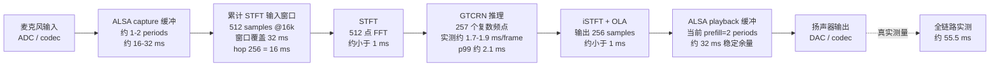

```mermaid
flowchart LR
    A[麦克风输入<br/>ADC / codec] --> B[ALSA capture 缓冲<br/>约 1-2 periods<br/>约 16-32 ms]
    B --> C[累计 STFT 输入窗口<br/>512 samples @16k<br/>窗口覆盖 32 ms<br/>hop 256 = 16 ms]
    C --> D[STFT<br/>512 点 FFT<br/>约小于 1 ms]
    D --> E[GTCRN 推理<br/>257 个复数频点<br/>实测约 1.7-1.9 ms/frame<br/>p99 约 2.1 ms]
    E --> F[iSTFT + OLA<br/>输出 256 samples<br/>约小于 1 ms]
    F --> G[ALSA playback 缓冲<br/>当前 prefill=2 periods<br/>约 32 ms 稳定余量]
    G --> H[扬声器输出<br/>DAC / codec]

    H -.真实测量.-> I[全链路实测<br/>约 55.5 ms]
```